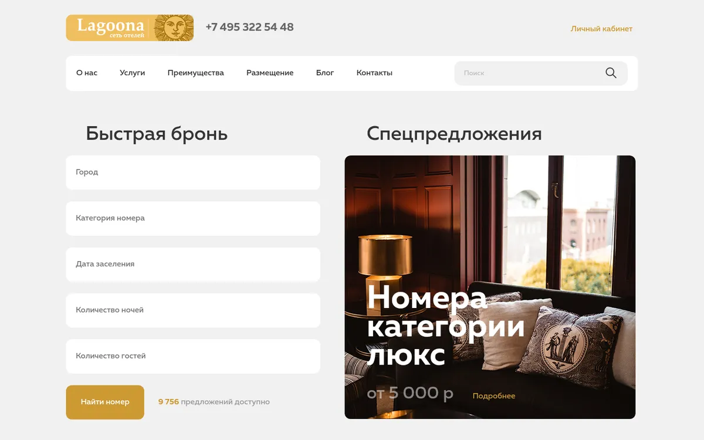
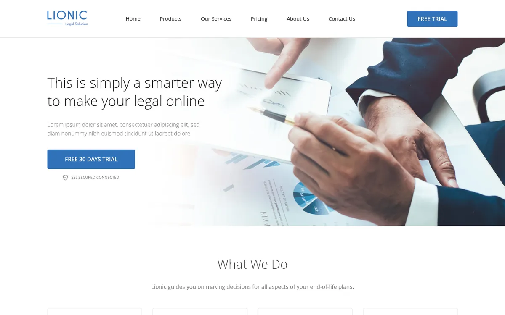
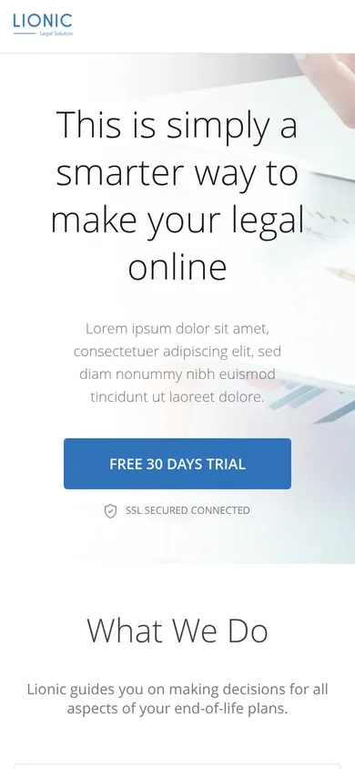
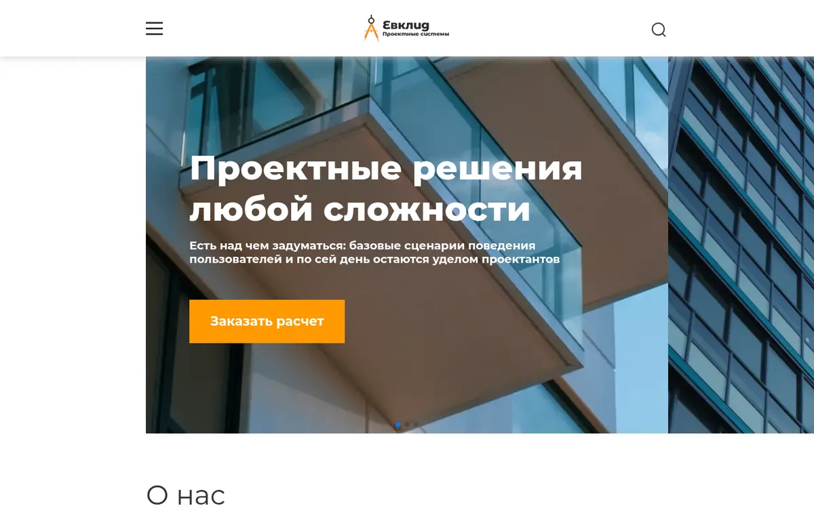

*Читать на [английском](./README.md).*

# website-portfolio

> 🗄️ **Архивный репозиторий (2020–2021).** Учебные вёрстки лендингов из начала моего пути во фронтенд. Код сохранён как память и не развивается: он не отражает мой нынешний уровень и подходы.

Три статичных лендинга по макетам (Figma / Photoshop). Без сборки и фреймворков: HTML, CSS и немного JavaScript.

## Проекты

| Проект | Демо | Что это | Стек | Адаптив |
| --- | --- | --- | --- | --- |
| [HOTEL](./HOTEL) | [открыть](https://barbarafromtonshaevo.github.io/website-portfolio/HOTEL/) | Лендинг сервиса бронирования отелей. Вёрстка «pixel perfect» | HTML, CSS (flexbox), normalize.css | нет, только десктоп |
| [LIONIC](./LIONIC) | [открыть](https://barbarafromtonshaevo.github.io/website-portfolio/LIONIC/) | Лендинг юридической компании, секции со статьями | HTML, CSS (flexbox, CSS-переменные), normalize.css | да, 4 брейкпоинта (1200 / 992 / 767 / 400 px) |
| [EVKLID](./EVKLID) | [открыть](https://barbarafromtonshaevo.github.io/website-portfolio/EVKLID/) | Лендинг с бургер-меню и переключаемыми шагами «как мы работаем» | HTML, CSS (flexbox), JS, Swiper, jQuery UI, lazyload | да, 4 диапазона: 320–767 / 768–1023 / 1024–1919 / от 1920 px |

В каждой папке лежит `project documents/` с исходным макетом (`.psd` / `.fig`).

## Скриншоты

Первый экран каждого лендинга.

**HOTEL**



**LIONIC** (десктоп и мобильная версия)

<p>
  
  
</p>

**EVKLID**



## Как посмотреть

Проще всего открыть ссылку из колонки «Демо»: лендинги опубликованы через GitHub Pages как есть, без сборки.

Локально: сборки нет, достаточно открыть `index.html` нужного проекта в браузере.

```bash
git clone https://github.com/BarbaraFromTonshaevo/website-portfolio.git
xdg-open website-portfolio/LIONIC/index.html   # macOS: open, Windows: start
```

EVKLID подключает Swiper, jQuery и lazyload с CDN, поэтому для него нужен интернет.

## Что здесь устарело

Я оставила всё как есть, чтобы было видно, с чего я начинала. Сейчас я бы сделала иначе:

- **Вёрстка и CSS.** Сейчас я использовала бы grid, `clamp()`, подход mobile-first и единую методологию именования. У EVKLID стили лежат минифицированными в одну строку, поэтому `css/style.css` там не читается. HOTEL вообще без адаптива.
- **Известная ошибка EVKLID.** На экранах уже 768 px первый экран пустой: мобильный CSS подключает фоны `mobile-background-*.jpg`, а в `img/` лежат `.webp`. Белый заголовок оказывается на белом фоне. Ошибку я оставила, как и остальной код.
- **Шрифты LIONIC не попали в репозиторий.** CSS ссылается на `fonts/open-sans-v18-*.woff2`, но папки `fonts/` нет. Если Open Sans не установлен в системе, браузер покажет запасной шрифт.
- **Зависимости.** Скрипты подключены с CDN без фиксации версий (`unpkg.com/swiper/…`), а jQuery 1.12.4 давно устарел. Сейчас это были бы npm-пакеты и сборщик.
- **Доступность и SEO.** Семантические теги и `alt` есть, но нет мета-описаний, `aria` только в EVKLID, а `lang="en"` стоит у русскоязычного EVKLID.
- **Вес репозитория.** Исходники макетов (`.psd`, `.fig`) занимают около 65 МБ из 130 МБ.

## Статус

Не поддерживается. Актуальные работы — в моих других репозиториях.
